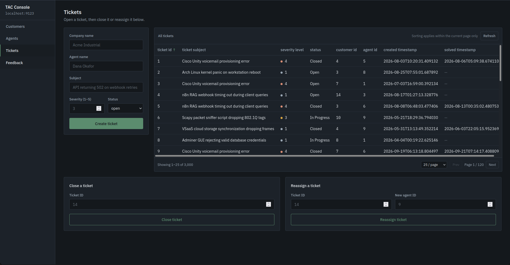
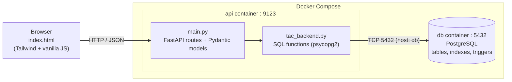
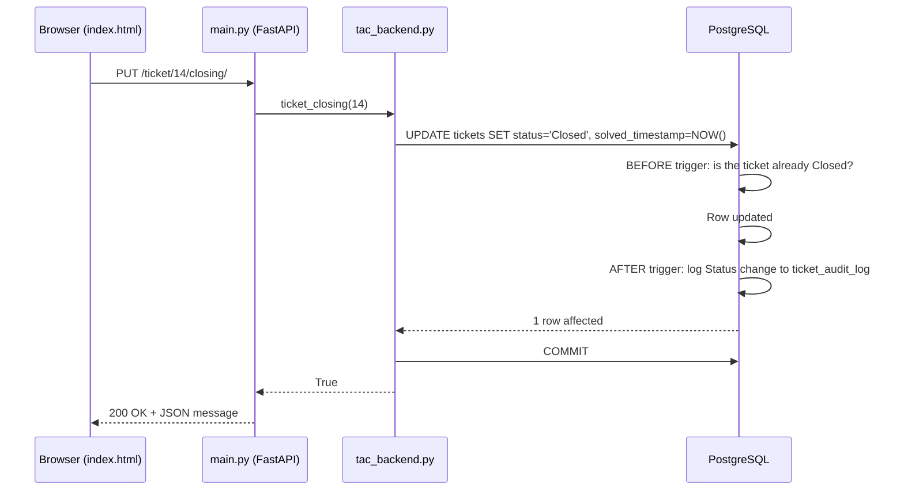
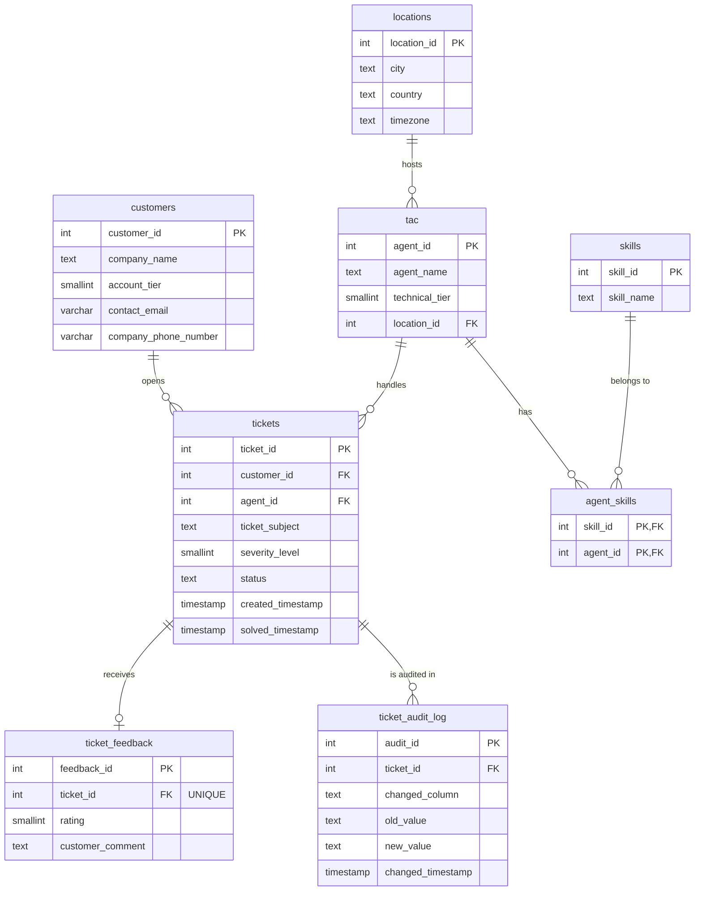

# TAC Console: Technical Assistance Center Ticketing Backend

A support-ticketing system for a Technical Assistance Center (TAC). It tracks **customers**, **support agents** (with their skills and locations), **tickets**, and **customer feedback**, and comes with a built-in web console so you can use everything from the browser.

Built as a full-stack backend project with **FastAPI**, **PostgreSQL**, and **Docker Compose**. The business rules (closed tickets are immutable, every status/severity change is audited) are enforced **inside the database** with triggers, not just in application code.


<!-- TODO: add a screenshot or GIF of the console here -->


---

## Table of Contents

1. [Features](#features)
2. [Tech Stack](#tech-stack)
3. [Architecture](#architecture)
4. [Project Structure](#project-structure)
5. [Getting Started](#getting-started)
6. [Using the Web Console](#using-the-web-console)
7. [API Reference](#api-reference)
8. [Database Design](#database-design)
9. [Sample Data](#sample-data)
10. [How the Code Works](#how-the-code-works)
11. [Design Decisions](#design-decisions)
12. [Useful SQL Queries](#useful-sql-queries)
13. [Known Limitations and Roadmap](#known-limitations-and-roadmap)
14. [Troubleshooting](#troubleshooting)
15. [License](#license)

---

## Features

- **Customer management**: register companies with an account tier, contact email, and phone number.
- **Agent management**: create agents with a technical tier, a location, and any number of skills, all in one atomic transaction.
- **Ticket lifecycle**: open tickets against a customer and an agent, reassign them, and close them (with an automatic solve timestamp).
- **Customer feedback**: attach a 1–5 rating and an optional comment to a ticket (one feedback entry per ticket).
- **Database-enforced business rules**
  - A **closed ticket cannot be modified** (trigger raises an exception).
  - Every change to a ticket's **status** or **severity** is written to an **audit log** automatically.
- **Two pagination strategies**: client-side for small tables, server-side (`limit`/`offset`) for the 3,000+ row tables.
- **Built-in web console**: a dark, responsive single-page UI served by the API itself. There is no separate frontend server and no CORS setup.
- **Interactive API docs**: Swagger UI at `/docs` and ReDoc at `/redoc`, generated by FastAPI.
- **One-command boot**: `docker compose up` starts the database and the API.
- **Realistic seed data**: 3,000 tickets, 15 customers, 10 agents, and up to 1,000 feedback entries, generated by pure SQL.

---

## Tech Stack

| Layer | Technology | Role |
|---|---|---|
| API framework | **FastAPI** | Routing, request validation, JSON serialization, auto docs |
| Validation | **Pydantic v2** | Typed request bodies (`AddCustomer`, `AddAgent`, …) |
| ASGI server | **Uvicorn** | Runs the FastAPI app |
| Database | **PostgreSQL** | Relational storage, triggers, indexes |
| DB driver | **psycopg2** (`psycopg2-binary`) | Raw parameterized SQL, no ORM |
| Frontend | **HTML + vanilla JavaScript + Tailwind CSS** | Single-file console (`index.html`) |
| Packaging | **Docker + Docker Compose** | Reproducible environment for API and DB |

---

## Architecture



### Request lifecycle: closing a ticket



The API is split into three clean layers:

1. **`main.py`** is the HTTP layer. It defines routes and Pydantic models and translates results into HTTP responses.
2. **`tac_backend.py`** is the data layer. It contains all SQL, transaction handling (commit/rollback), and logging.
3. **PostgreSQL** owns data integrity: foreign keys, uniqueness, and triggers.

---

## Project Structure

```text
.
├── main.py             # FastAPI app: routes, request models, serves the UI
├── tac_backend.py      # Database layer: all SQL and transaction logic
├── index.html          # Web console (single file, no build step)
├── Tables.sql          # Schema: tables, indexes, trigger functions, triggers
├── DummyData.sql       # Seed script: generates realistic sample data
├── Dockerfile          # Builds the API image
├── compose.yaml        # Orchestrates the api + db containers
├── requirements.txt    # Pinned Python dependencies
└── docs/
    └── images/         # Screenshots used in this README
```

| File | What it does |
|---|---|
| `main.py` | Creates the `FastAPI()` app, defines 14 endpoints, validates bodies with Pydantic, and returns `FileResponse("index.html")` at `/`. |
| `tac_backend.py` | Opens the PostgreSQL connection and exposes `add_*`, `get_*`, `ticket_closing`, `new_agent`, and paged query functions. |
| `index.html` | The console UI: sidebar navigation, forms for every write operation, and searchable/sortable/paginated tables. |
| `Tables.sql` | Creates 8 tables, 5 indexes, 2 trigger functions, and 2 triggers. |
| `DummyData.sql` | Wipes all tables and refills them with random-but-realistic data. |
| `Dockerfile` | `python:3.14` image, installs requirements, runs Uvicorn on port `9123`. |
| `compose.yaml` | Defines the `db` (PostgreSQL) and `api` services and a persistent `pgdata` volume. |

---

## Getting Started

### Prerequisites

- [Docker](https://docs.docker.com/get-docker/) with the Compose plugin (Docker Desktop includes it). Check with `docker compose version`.
- [Git](https://git-scm.com/downloads)
- Free ports **9123** (API) and **5432** (PostgreSQL). If 5432 is taken by a local Postgres, see [Troubleshooting](#troubleshooting).
- An internet connection for the first run (pulls images) and whenever you open the console (it loads Tailwind and fonts from CDNs).

You do **not** need Python or PostgreSQL installed locally.

### 1. Clone the repository

```bash
git clone https://github.com/SateHad/tac-ticketing-backend.git
cd tac-ticketing-backend
```

### 2. Build and start everything

```bash
docker compose up --build
```

This builds the API image, pulls PostgreSQL, and starts both containers. Add `-d` to run in the background:

```bash
docker compose up --build -d
```

> **Heads-up:** the API opens its database connection when it starts. If PostgreSQL is still initializing, the `api` container may exit and restart once or twice (`restart: always` handles it). Give it a few seconds and it settles.

### 3. Create the tables

The database starts **empty**. Load the schema once:

```bash
docker compose cp Tables.sql db:/tmp/Tables.sql
docker compose exec db psql -U postgres -d postgres -v ON_ERROR_STOP=1 -f /tmp/Tables.sql
```

You should see a series of `CREATE TABLE`, `CREATE INDEX`, `CREATE FUNCTION`, and `CREATE TRIGGER` lines.

<details>
<summary>Shortcut for Linux / macOS / WSL (stdin redirect)</summary>

```bash
docker compose exec -T db psql -U postgres -d postgres -v ON_ERROR_STOP=1 < Tables.sql
```

Use the `cp` + `-f` method above on Windows PowerShell. PowerShell's `<` operator and its default encoding can break piped SQL files.
</details>

### 4. Load the sample data (optional, recommended)

```bash
docker compose cp DummyData.sql db:/tmp/DummyData.sql
docker compose exec db psql -U postgres -d postgres -v ON_ERROR_STOP=1 -f /tmp/DummyData.sql
```

> **Warning:** `DummyData.sql` begins with `TRUNCATE ... RESTART IDENTITY CASCADE`. It **deletes all existing data** in every table. Only run it on a database you're happy to reset.

### 5. Open the app

| What | URL |
|---|---|
| Web console | <http://localhost:9123> |
| Swagger UI (interactive API docs) | <http://localhost:9123/docs> |
| ReDoc | <http://localhost:9123/redoc> |

Quick health check from the terminal:

```bash
curl http://localhost:9123/customers/query/
```

If you loaded the sample data, you'll get a JSON array of 15 customers.

### Everyday commands

| Task | Command |
|---|---|
| Start (after first build) | `docker compose up -d` |
| Stop, keep data | `docker compose down` |
| Stop and **delete all data** | `docker compose down -v` |
| Rebuild after changing code | `docker compose up --build -d` |
| Follow API logs | `docker compose logs -f api` |
| Follow DB logs | `docker compose logs -f db` |
| Open a SQL shell | `docker compose exec db psql -U postgres` |

### Resetting the database from scratch

`Tables.sql` is not idempotent (running it twice fails with `already exists`). To start over:

```bash
docker compose down -v          # removes containers AND the pgdata volume
docker compose up --build -d
# then repeat steps 3 and 4
```

### Connecting with a database client

PostgreSQL is published on your machine, so any client (DBeaver, pgAdmin, Adminer, `psql`, …) can connect:

| Setting | Value |
|---|---|
| Host | `localhost` |
| Port | `5432` |
| Database | `postgres` |
| User | `postgres` |
| Password | `securepass` |

> These are **development-only** credentials. See [Known Limitations](#known-limitations-and-roadmap).

### Running without Docker (local development)

1. Install Python 3.14 (or a compatible version) and PostgreSQL, and create a database.
2. Load `Tables.sql` (and optionally `DummyData.sql`) into it.
3. In `tac_backend.py`, change `host="db"` to `host="localhost"` and adjust the credentials. (`db` is the Docker Compose service name and only resolves inside Docker's network.)
4. Run:

```bash
python -m venv .venv
source .venv/bin/activate        # Windows: .venv\Scripts\activate
pip install -r requirements.txt
uvicorn main:app --reload --port 9123
```

---

## Using the Web Console

Open <http://localhost:9123>. The sidebar has four sections; each one has a form on the left and a live table on the right.

| Section | Forms | Table |
|---|---|---|
| **Customers** | *Create customer*: company name, account tier, contact email, phone | All customers, with search, column sorting, and pagination |
| **Agents** | *Create agent*: name, technical tier, location ID, comma-separated skill IDs (e.g. `1, 3`) | All agents, with search, column sorting, and pagination |
| **Tickets** | *Create ticket* (company name, agent name, subject, severity 1–5, status), *Close ticket* (by ID), *Reassign ticket* (ticket ID + agent ID) | Server-paginated tickets |
| **Feedback** | *Submit feedback*: ticket ID, rating 1–5, optional comment | Server-paginated feedback |

Behavior worth knowing:

- Success and error messages appear in a **banner** at the top and auto-hide after a few seconds.
- After every successful write, the relevant table refreshes automatically.
- **Customers and Agents** tables download the full collection once, then search, sort, and paginate **in the browser**. They are small.
- **Tickets and Feedback** tables request one page at a time from the server (25 / 50 / 100 rows per page). Sorting applies **within the current page only**, and the UI says so.
- Severity levels get a colored dot (grey to red as severity rises).
- All cell values are HTML-escaped before rendering, which prevents script injection from stored data.

---

## API Reference

Base URL: `http://localhost:9123`. All request and response bodies are JSON. Full interactive documentation is at `/docs`.

### Endpoint summary

| Method | Path | Purpose | Success |
|---|---|---|---|
| `GET` | `/` | Serves the web console (`index.html`) | `200` |
| `POST` | `/customers/` | Create a customer | `201` |
| `POST` | `/agent/` | Create an agent with skills | `201` |
| `POST` | `/ticket/` | Create a ticket | `201` |
| `PUT` | `/ticket/{ticket_id}/closing/` | Close a ticket | `200` |
| `PUT` | `/ticket/{ticket_id}/change/` | Reassign a ticket to another agent | `200` |
| `POST` | `/feedback/` | Add feedback to a ticket | `201` |
| `GET` | `/customers/query/` | List **all** customers | `200` |
| `GET` | `/agents/query/` | List **all** agents | `200` |
| `GET` | `/tickets/query/` | List **all** tickets (3,000+ rows with sample data) | `200` |
| `GET` | `/tickets/page/` | Paginated tickets (`limit`, `offset`) | `200` |
| `GET` | `/feedback/query/` | List **all** feedback | `200` |
| `GET` | `/feedback/page/` | Paginated feedback (`limit`, `offset`) | `200` |

### Request bodies

**`POST /customers/`**

| Field | Type | Notes |
|---|---|---|
| `company_name` | string | Used later to look up the customer when creating tickets |
| `account_tier` | integer | Stored as `SMALLINT` |
| `contact_email` | string | Max 254 characters (DB limit) |
| `company_phone_number` | string | Max 15 characters (DB limit) |

**`POST /agent/`**

| Field | Type | Notes |
|---|---|---|
| `agent_name` | string | Used later to look up the agent when creating tickets |
| `technical_tier` | integer | Support tier of the agent |
| `location_id` | integer | Must exist in `locations` |
| `skill_ids` | array of integers | Each must exist in `skills`, with no duplicates |

**`POST /ticket/`**

| Field | Type | Notes |
|---|---|---|
| `company_name` | string | Exact match against `customers.company_name` |
| `agent_name` | string | Exact match against `tac.agent_name` |
| `ticket_subject` | string | Free text |
| `severity_level` | integer | Intended range 1–5 |
| `status` | string | Use `Open`, `In Progress`, or `Closed` (see [limitations](#known-limitations-and-roadmap)) |

**`PUT /ticket/{ticket_id}/change/`**

| Field | Type | Notes |
|---|---|---|
| `agent_id` | integer | Must exist in `tac` |

**`POST /feedback/`**

| Field | Type | Notes |
|---|---|---|
| `ticket_id` | integer | Must exist; **only one feedback per ticket** |
| `rating` | integer | Intended range 1–5 |
| `customer_comment` | string or `null` | Optional |

### Pagination parameters

| Parameter | Default | Constraints |
|---|---|---|
| `limit` | `25` | 1 ≤ limit ≤ 100 |
| `offset` | `0` | ≥ 0 |

Out-of-range values are rejected by FastAPI with `422 Unprocessable Entity`.

### Examples (curl)

Create a customer:

```bash
curl -X POST http://localhost:9123/customers/ \
  -H "Content-Type: application/json" \
  -d '{
        "company_name": "Acme Industrial",
        "account_tier": 1,
        "contact_email": "ops@acme.com",
        "company_phone_number": "+962790000000"
      }'
```

```json
{ "message": "Customer created successfully.", "customer_id": 16 }
```

Create an agent with two skills (location `1` = Amman in the sample data):

```bash
curl -X POST http://localhost:9123/agent/ \
  -H "Content-Type: application/json" \
  -d '{"agent_name": "Dana Okafor", "technical_tier": 2, "location_id": 1, "skill_ids": [1, 3]}'
```

Create a ticket (names must match existing records exactly):

```bash
curl -X POST http://localhost:9123/ticket/ \
  -H "Content-Type: application/json" \
  -d '{
        "company_name": "Acme Industrial",
        "agent_name": "Tariq Haddad",
        "ticket_subject": "API returning 502 on webhook retries",
        "severity_level": 3,
        "status": "Open"
      }'
```

Reassign, close, and give feedback:

```bash
# Reassign ticket 3001 to agent 4
curl -X PUT http://localhost:9123/ticket/3001/change/ \
  -H "Content-Type: application/json" -d '{"agent_id": 4}'

# Close ticket 3001 (sets status = 'Closed' and solved_timestamp = NOW())
curl -X PUT http://localhost:9123/ticket/3001/closing/

# Leave feedback on ticket 3001
curl -X POST http://localhost:9123/feedback/ \
  -H "Content-Type: application/json" \
  -d '{"ticket_id": 3001, "rating": 5, "customer_comment": "Fast and clear."}'
```

Fetch page 3 of tickets, 10 per page:

```bash
curl "http://localhost:9123/tickets/page/?limit=10&offset=20"
```

```json
{
  "tickets": [
    {
      "ticket_id": 21,
      "customer_id": 4,
      "agent_id": 7,
      "ticket_subject": "CUCM routing failure on main SIP trunk",
      "severity_level": 2,
      "status": "Closed",
      "created_timestamp": "2026-05-12T14:03:22.123456",
      "solved_timestamp": "2026-05-14T09:41:10.654321"
    }
  ],
  "total": 3000,
  "limit": 10,
  "offset": 20
}
```

(Truncated to one ticket for brevity. Values are illustrative because sample data is random.)

### Error responses

| Status | When |
|---|---|
| `422` | Request body or query parameters fail validation (missing field, wrong type, `limit` out of range) |
| `500` | Any database-level failure: unknown company/agent name, foreign-key violation, duplicate feedback, modifying a closed ticket, and so on. The body is `{"detail": "Database failed"}`. The **real** error is printed in the API logs (`docker compose logs api`). |

> See [Known Limitations](#known-limitations-and-roadmap) for why some cases that should be `404` currently return `500`.

---

## Database Design

### Entity-relationship diagram



> The agents table is named **`tac`** (Technical Assistance Center staff). "TAC agent" and "row in `tac`" mean the same thing.

### Tables

#### `locations`: where agents work
| Column | Type | Constraints |
|---|---|---|
| `location_id` | `SERIAL` | Primary key |
| `city` | `TEXT` | `NOT NULL` |
| `country` | `TEXT` | `NOT NULL` |
| `timezone` | `TEXT` | `NOT NULL` (e.g. `+03:00`) |

#### `customers`: companies that raise tickets
| Column | Type | Constraints |
|---|---|---|
| `customer_id` | `SERIAL` | Primary key |
| `company_name` | `TEXT` | `NOT NULL` |
| `account_tier` | `SMALLINT` | `NOT NULL` |
| `contact_email` | `VARCHAR(254)` | `NOT NULL` (254 is the practical maximum email length) |
| `company_phone_number` | `VARCHAR(15)` | `NOT NULL` (15 is the E.164 maximum) |

#### `skills`: skill catalogue
| Column | Type | Constraints |
|---|---|---|
| `skill_id` | `SERIAL` | Primary key |
| `skill_name` | `TEXT` | `NOT NULL` |

#### `tac`: support agents
| Column | Type | Constraints |
|---|---|---|
| `agent_id` | `SERIAL` | Primary key |
| `agent_name` | `TEXT` | `NOT NULL` |
| `technical_tier` | `SMALLINT` | `NOT NULL` |
| `location_id` | `INT` | `NOT NULL`, FK to `locations(location_id)` |

#### `agent_skills`: many-to-many link between agents and skills
| Column | Type | Constraints |
|---|---|---|
| `skill_id` | `INT` | `NOT NULL`, FK to `skills` |
| `agent_id` | `INT` | `NOT NULL`, FK to `tac` |

**Composite primary key** `(skill_id, agent_id)`. An agent can't be given the same skill twice.

#### `tickets`: the core table
| Column | Type | Constraints |
|---|---|---|
| `ticket_id` | `SERIAL` | Primary key |
| `customer_id` | `INT` | `NOT NULL`, FK to `customers` |
| `agent_id` | `INT` | `NOT NULL`, FK to `tac` |
| `ticket_subject` | `TEXT` | `NOT NULL` |
| `severity_level` | `SMALLINT` | `NOT NULL` |
| `status` | `TEXT` | `NOT NULL` |
| `created_timestamp` | `TIMESTAMP` | `NOT NULL DEFAULT NOW()` |
| `solved_timestamp` | `TIMESTAMP` | Nullable, filled when a ticket is closed |

#### `ticket_feedback`: customer ratings
| Column | Type | Constraints |
|---|---|---|
| `feedback_id` | `SERIAL` | Primary key |
| `ticket_id` | `INT` | `NOT NULL`, **`UNIQUE`**, FK to `tickets` |
| `rating` | `SMALLINT` | `NOT NULL` |
| `customer_comment` | `TEXT` | Nullable |

The `UNIQUE` constraint on `ticket_id` makes this a **one-to-one** relationship (at most one feedback per ticket).

#### `ticket_audit_log`: automatic change history
| Column | Type | Constraints |
|---|---|---|
| `audit_id` | `SERIAL` | Primary key |
| `ticket_id` | `INT` | `NOT NULL`, FK to `tickets` |
| `changed_column` | `TEXT` | `NOT NULL` (`'Status'` or `'Severity_Level'`) |
| `old_value` | `TEXT` | `NOT NULL` |
| `new_value` | `TEXT` | `NOT NULL` |
| `changed_timestamp` | `TIMESTAMP` | Set to `NOW()` by the trigger |

Nobody writes to this table by hand. The trigger below does it.

### Relationships at a glance

| Relationship | Cardinality |
|---|---|
| location → agents | one-to-many |
| customer → tickets | one-to-many |
| agent → tickets | one-to-many |
| agents ↔ skills | many-to-many (via `agent_skills`) |
| ticket → feedback | one-to-zero-or-one |
| ticket → audit entries | one-to-many |

### Indexes

| Index | Column | Why |
|---|---|---|
| `index_tickets_status` | `tickets(status)` | Filter by Open / In Progress / Closed |
| `index_tickets_severity` | `tickets(severity_level)` | Filter by severity |
| `index_tickets_customer` | `tickets(customer_id)` | "All tickets for this customer" and FK joins |
| `index_tickets_agent` | `tickets(agent_id)` | "All tickets for this agent" and FK joins |
| `index_tac_locations` | `tac(location_id)` | Agents by location |

PostgreSQL creates indexes for primary keys and `UNIQUE` constraints automatically, but **not** for foreign-key columns, which is why the FK columns above are indexed by hand.

### Triggers (business rules inside the database)

**1. `trigger_audit_ticket`: audit log** (`AFTER UPDATE ON tickets`, per row)

Runs the function `ticket_changes_log()`:

- If `Status` changed, insert `('Status', old, new)` into `ticket_audit_log`.
- If `Severity_Level` changed, insert `('Severity_Level', old, new)`.

**2. `closed_ticket_protection`: immutability** (`BEFORE UPDATE ON tickets`, per row)

Runs `lock_closed_tickets()`:

```sql
IF OLD.Status = 'Closed' THEN
    RAISE EXCEPTION 'Cannot modify a closed ticket. Ticket ID = %', OLD.Ticket_Id;
END IF;
```

**How they cooperate when closing a ticket**

1. `UPDATE ... SET status = 'Closed'` starts.
2. The **BEFORE** trigger checks the *old* row. It isn't closed yet, so the update proceeds.
3. The row is updated.
4. The **AFTER** trigger sees `Open → Closed` and writes an audit entry.

Any later update to that row (reassigning it, changing severity, closing it again) is rejected by the BEFORE trigger, and the whole transaction is rolled back.

**Try it yourself:**

```sql
-- pick any closed ticket
SELECT ticket_id FROM tickets WHERE status = 'Closed' LIMIT 1;

-- now try to modify it (replace 123 with the id above)
UPDATE tickets SET severity_level = 5 WHERE ticket_id = 123;
-- ERROR:  Cannot modify a closed ticket. Ticket ID = 123
```

---

## Sample Data

`DummyData.sql` generates deterministic *structure* with random *values*. Every run produces different data.

| Step | What it creates |
|---|---|
| 0 | `TRUNCATE ... RESTART IDENTITY CASCADE` on all tables, so IDs restart at 1 |
| 1 | **3 locations**: Amman (Jordan), Düsseldorf (Germany), London (UK) |
| 2 | **15 customers**: names from 5 company templates + a number, random tier 1–3, unique emails and phone numbers |
| 3 | **5 skills**: Unified Communications (CUCM), VSaaS & Cloud Storage, Linux & Server Admin, Database Architecture, AI Workflow Automation |
| 4 | **10 agents** with a random tier (1–3) and random location |
| 5 | **1 random skill per agent** (`agent_skills`) |
| 6 | **3,000 tickets**: random customer and agent, one of 8 realistic subjects, severity 1–4, status drawn from `Open / In Progress / Closed / Closed`, so about half are closed. Created at random moments in the **last 180 days** |
| 7 | **Solved timestamps** for closed tickets: created time + up to 5 days |
| 8 | **Up to 1,000 feedback rows** for closed tickets, with a random rating (1–5) and one of 4 comments |

**Why does the script disable a trigger?** Step 7 updates rows that are already `Closed`, which the immutability trigger would (correctly) block. The script runs `ALTER TABLE tickets DISABLE TRIGGER closed_ticket_protection;` before the bulk load and re-enables it afterward. Only that one trigger is disabled, and only for the duration of the seeding.

---

## How the Code Works

### `main.py`: the HTTP layer

- Creates `app = FastAPI()` and imports `tac_backend` as the data layer.
- **Pydantic models** (`AddCustomer`, `AddAgent`, `AddTicket`, `ChangeAgent`, `AddFeedback`) describe and validate request bodies. FastAPI returns `422` automatically on bad input and uses the models to generate `/docs`.
- Every write endpoint follows the same shape: call the backend function, check whether it returned a value, and return a JSON message. Otherwise respond with an HTTP error.
- Read endpoints return the backend's rows directly. FastAPI serializes `datetime` values to ISO-8601 strings.
- `GET /` returns `FileResponse("index.html")`. Serving the UI from the same origin means the browser JavaScript can call the API with relative URLs and no CORS configuration.
- Paged endpoints use `Query(default=25, ge=1, le=100)` and `Query(default=0, ge=0)` so limits are enforced before any SQL runs.

### `tac_backend.py`: the data layer

A module-level `psycopg2` connection is opened when the module is imported (`host="db"` is the Compose service name). Each function follows the same pattern:

```python
with connection.cursor() as cursor:
    try:
        cursor.execute(SQL, (params,))   # parameterized: values never concatenated into SQL
        ...
        connection.commit()              # success: make it permanent
        return result
    except Exception as e:
        print(f"Database error: {e}")    # goes to `docker compose logs api`
        connection.rollback()            # failure: undo everything
```

| Function | What it does |
|---|---|
| `add_customer` | Inserts a customer, returns the new `customer_id` via `RETURNING`. |
| `add_agent` | In **one transaction**: inserts the agent, then one `agent_skills` row per skill ID. If any skill ID is invalid or duplicated, **everything rolls back**, so no half-created agents. |
| `add_ticket` | Resolves `company_name` to `customer_id` and `agent_name` to `agent_id`, then inserts the ticket. Returns the new `ticket_id`. |
| `ticket_closing` | `UPDATE tickets SET status = 'Closed', solved_timestamp = NOW()`. Returns `False` if no row matched. |
| `new_agent` | Reassigns a ticket by updating `agent_id`. Returns `False` if the ticket doesn't exist. |
| `add_feedback` | Inserts rating and optional comment, returns `feedback_id`. |
| `get_all_*` | `SELECT *` using `RealDictCursor`, so each row becomes a dict and serializes straight to JSON. |
| `get_tickets_page` / `get_feedback_page` | Run `COUNT(*)` for the total, then `SELECT ... ORDER BY id LIMIT %s OFFSET %s`. Return `(rows, total)`. |

### `index.html`: the console

A single file with no build step:

- **Tailwind (CDN)** for styling, **IBM Plex** fonts, and a custom dark palette defined in `tailwind.config`.
- `apiRequest(path, method, body)` is the one function that talks to the API. It sends JSON, parses the response, and turns non-2xx responses into `Error`s carrying the server's `detail` message, which the banner then displays.
- **`DataTable` class** (Customers, Agents): fetches everything once, then does search, filtering, sorting, and pagination in memory.
- **`ServerPagedTable` class** (Tickets, Feedback): requests `?limit=&offset=` on every page or page-size change and reads `total` from the response to compute the page count.
- `renderTable()` builds the HTML, escapes every value, prints `null` as `—`, and adds the severity dot.
- Each form has its own submit handler that builds the payload (e.g. splitting `"1, 3"` into `[1, 3]`), calls `apiRequest`, shows the banner, and refreshes the right table.

### `Dockerfile`

```dockerfile
FROM python:3.14
WORKDIR /app
COPY ./requirements.txt /app/requirements.txt      # copied first so the pip layer is cached
RUN pip install --no-cache-dir --upgrade -r /app/requirements.txt
COPY . .                                           # then the source (changes often)
EXPOSE 9123
CMD ["uvicorn", "main:app", "--host", "0.0.0.0", "--port", "9123"]
```

`--host 0.0.0.0` is required so the app is reachable from outside the container.

### `compose.yaml`

| Service | Details |
|---|---|
| `db` | Official `postgres` image, `restart: always`, `shm_size: 128mb`, password set via `POSTGRES_PASSWORD`, port `5432` published, data stored in the named volume `pgdata` (survives `docker compose down`, removed by `down -v`). |
| `api` | Built from the local `Dockerfile`, `restart: always`, port `9123` published, `depends_on: db` (start order only, it doesn't wait for PostgreSQL to be *ready*). |

Both services share Compose's default network, which is why the API can reach the database at the hostname `db`.

---

## Design Decisions

| Decision | Reasoning |
|---|---|
| **Raw SQL with psycopg2, no ORM** | Full control over queries, transactions, and triggers, and a clear view of what actually runs against the database. |
| **Parameterized queries everywhere** | Values are passed separately (`%s`) and never string-formatted into SQL, which prevents SQL injection. |
| **Rules in the database (triggers)** | Immutability of closed tickets and the audit trail hold no matter which client writes to the database (this API, a script, or a SQL shell). |
| **Transactions with rollback** | Multi-step writes such as `add_agent` are all-or-nothing. |
| **Two pagination strategies** | Small tables are cheap to ship whole and get instant client-side search. Tickets (3,000+) use `limit`/`offset` so the browser only ever holds one page. |
| **Deterministic `ORDER BY` in paged queries** | Without it, PostgreSQL doesn't guarantee row order, so pages could overlap or skip rows. |
| **UI served by the API** | One origin, one port, no CORS, one container to deploy. |
| **Composite PK on `agent_skills`** | Prevents duplicate skill assignments at the schema level. |
| **`UNIQUE` on `ticket_feedback.ticket_id`** | Enforces one feedback per ticket in the schema, not in code. |
| **Indexes on filter and FK columns** | Keeps status, severity, customer, and agent lookups fast as the tickets table grows. |

---

## Useful SQL Queries

Open a shell with `docker compose exec db psql -U postgres` and try these.

**Tickets by status**
```sql
SELECT status, COUNT(*) AS tickets
FROM tickets
GROUP BY status
ORDER BY tickets DESC;
```

**Average resolution time per agent (hours)**
```sql
SELECT a.agent_name,
       COUNT(*) AS closed_tickets,
       ROUND(AVG(EXTRACT(EPOCH FROM (t.solved_timestamp - t.created_timestamp)) / 3600)::numeric, 1) AS avg_hours
FROM tickets t
JOIN tac a ON a.agent_id = t.agent_id
WHERE t.status = 'Closed'
GROUP BY a.agent_name
ORDER BY avg_hours;
```

**Average customer rating per agent**
```sql
SELECT a.agent_name,
       ROUND(AVG(f.rating), 2) AS avg_rating,
       COUNT(*) AS responses
FROM ticket_feedback f
JOIN tickets t ON t.ticket_id = f.ticket_id
JOIN tac a     ON a.agent_id  = t.agent_id
GROUP BY a.agent_name
ORDER BY avg_rating DESC;
```

**Agents with their location and skills**
```sql
SELECT a.agent_name,
       l.city,
       string_agg(s.skill_name, ', ' ORDER BY s.skill_name) AS skills
FROM tac a
JOIN locations l         ON l.location_id = a.location_id
LEFT JOIN agent_skills x ON x.agent_id    = a.agent_id
LEFT JOIN skills s       ON s.skill_id    = x.skill_id
GROUP BY a.agent_name, l.city
ORDER BY a.agent_name;
```

**Open tickets per customer, worst severity first**
```sql
SELECT c.company_name, COUNT(*) AS open_tickets, MAX(t.severity_level) AS worst_severity
FROM tickets t
JOIN customers c ON c.customer_id = t.customer_id
WHERE t.status <> 'Closed'
GROUP BY c.company_name
ORDER BY worst_severity DESC, open_tickets DESC;
```

**Latest audit-log entries**
```sql
SELECT * FROM ticket_audit_log ORDER BY changed_timestamp DESC LIMIT 20;
```

---

## Known Limitations and Roadmap

This is a learning project, and I've documented its rough edges openly. They're also a to-do list for future versions.

**Correctness and API behavior**
- [ ] **Errors collapse to `500`.** In `main.py`, the broad `except Exception` also catches the `HTTPException(404)` raised just above it, so "ticket not found" surfaces as `500 Database failed`. Closing an already-closed ticket (blocked by the trigger) also returns `500`. Fix: `except HTTPException: raise` before the generic handler, and return distinct errors for not-found, conflict, and true database failures.
- [ ] **Status values are inconsistent.** The database logic expects `Open`, `In Progress`, `Closed` (capitalized, and the trigger compares against `'Closed'`), but the console's status dropdown sends lowercase values (`open`, `in_progress`, `pending`, `closed`). A ticket created as `closed` from the UI would not be protected by the trigger. Fix: one canonical set of values, enforced with a `CHECK` constraint or an enum type.
- [ ] **Weak input validation.** Severity (1–5), rating (1–5), and tier ranges are enforced only by the UI form. Add `Field(ge=1, le=5)`, `EmailStr`, and a status `Literal` in the Pydantic models, plus `CHECK` constraints in SQL.
- [ ] **Tickets are created by company/agent *name***, which aren't unique. Switch to `customer_id` / `agent_id`.
- [ ] Reassigning a ticket isn't recorded in the audit log (only status and severity are).

**Architecture**
- [ ] **One shared database connection** for all requests. Move to a connection pool (`psycopg2.pool` or `psycopg[pool]`) so concurrent requests can't interfere with each other's transactions.
- [ ] **Credentials are hard-coded** in `tac_backend.py` and `compose.yaml`. Move to environment variables / a `.env` file (and never commit real secrets).
- [ ] **No authentication or authorization.** Anyone who can reach the port can read and write everything.
- [ ] **Schema isn't loaded automatically.** Mount the SQL files into `/docker-entrypoint-initdb.d/` (runs on first boot of an empty volume) or adopt migrations (Alembic).
- [ ] **No healthcheck**: the API can start before PostgreSQL is ready. Add a `healthcheck` on `db` and `depends_on: condition: service_healthy`.

**Scale and UX**
- [ ] `/…/query/` endpoints return every row. Fine for dozens of records, heavy for thousands.
- [ ] Sorting on Tickets/Feedback applies to the current page only. Add server-side `sort` and `filter` parameters.
- [ ] `OFFSET` pagination slows down on very deep pages. Keyset pagination (`WHERE ticket_id > last_seen`) scales better.
- [ ] The Tailwind **Play CDN** is meant for prototyping. Compile Tailwind for production, and self-host fonts for offline use.

**Quality**
- [ ] Automated tests (`pytest` + FastAPI `TestClient`) and a GitHub Actions CI workflow.
- [ ] Trim `requirements.txt` to direct dependencies (currently a full `pip freeze`), and consider `python:3.14-slim` for a smaller image.
- [ ] Pin the PostgreSQL image (e.g. `postgres:18`) instead of the floating `latest` tag.

---

## Troubleshooting

| Symptom | Likely cause and fix |
|---|---|
| `relation "customers" does not exist` in logs or `Could not load…` in the UI tables | Schema not loaded. Run [step 3](#3-create-the-tables). |
| `api` container keeps restarting on first boot | PostgreSQL wasn't ready when the API tried to connect. Wait a few seconds; `restart: always` retries automatically. Check with `docker compose logs api`. |
| `could not translate host name "db"` | You're running the API **outside** Docker. Change `host="db"` to `host="localhost"` (see [Running without Docker](#running-without-docker-local-development)). |
| `port is already allocated` / `address already in use` | Something else uses 5432 or 9123. Change the left side of the mapping in `compose.yaml`, e.g. `"5433:5432"` or `"9124:9123"`. |
| `already exists` errors when loading `Tables.sql` | Schema is already there. Reset with `docker compose down -v` and start over. |
| `500 Database failed` from the API | Read the real reason: `docker compose logs api`. Usual suspects: company/agent name doesn't match exactly, foreign key doesn't exist, duplicate feedback for a ticket, or editing a closed ticket. |
| Console loads but looks unstyled | Tailwind and fonts come from CDNs, so you need an internet connection. |
| Code changes have no effect | The image bakes in a copy of your code. Rebuild: `docker compose up --build -d`. |
| Sample data script fails at `TRUNCATE` | Tables don't exist yet. Run `Tables.sql` first. |

---

## License

Released under the [MIT License](LICENSE).

---

## Author

Built by **Sate Haddadin** as a first backend project. Feedback and suggestions are welcome: open an issue or reach out via [GitHub](https://github.com/SateHad).
